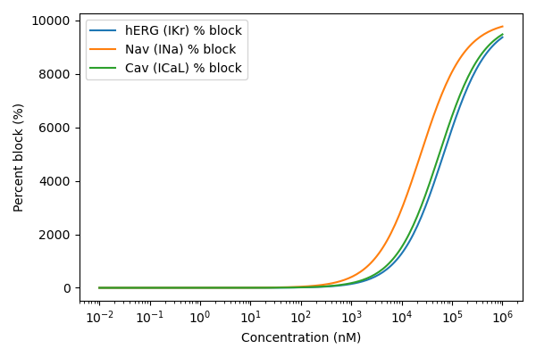
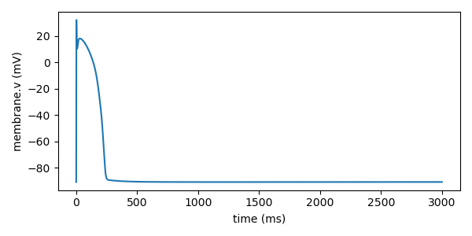

# Pipeline Report
## Input
- SMILES: CCO
- Dose (nM): 100.0
## IC50 Predictions
| Channel | pIC50 | IC50 (nM) |
|---|---:|---:|
| HERG | 4.167536905713713 | 67992.82632328934 |
| NAV | 4.6218658780395785 | 23885.488179291708 |
| CAV | 4.253881897931607 | 55733.72906633142 |

## Dose-response

## ORd Simulation

## Simulation Features
- **RMP**: -90.74808065677433
- **Peak**: 32.357062985634705
- **APD50**: 192.5
- **APD90**: 233.3
- **Triangulation**: 40.80000000000001
- **APA**: 123.10514364240905

## Classification
- Predicted class: **4** (Very High)
- Description: Very high blocking
- Probabilities: {"1": 0.05786023358758634, "2": 0.012932636061519754, "3": 0.036380181358814115, "4": 0.8928269489920798}
